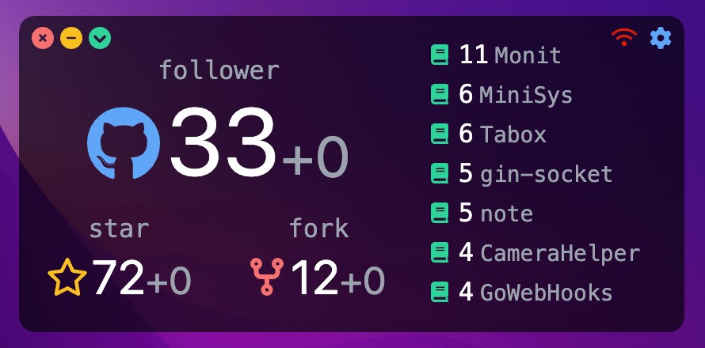

# Monit

> 用于实时监控自己的 Github 信息
> 
> 使用 vue + electron 开发

## 介绍

- 按钮作用 (从左至右
  - 关闭
  - 最小化
  - 置顶/取消置顶
  - 
  - 网络异常
  - 设置用户

- 展示信息（从上至下，从左至右
  - 你的 follower 数量
  - 你获得的总 star 数量
  - 你获得的总 fork 数量
  - 按照 star 排序展示仓库 (可滚动

> 注: 每 60s 发送一次请求

## Todo

- [x] 页面结构
- [x] 基本功能
- [x] 菜单设置
- [x] 无网络提示
- [x] 仓库可滚动
- [ ] 开机自启
- [ ] 消息通知
- [ ] 接入更多平台